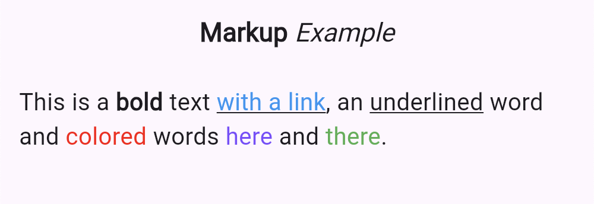

# markup_text_plus


[](https://pub.dev/packages/markup_text_plus)

Flutter widget to use Markup to easily create formatted Text. It supports bold, italic, underlined, links, color and custom tags.

## Features
- Support for custom tags
- Support for `TextSpan`

## Usage

`MarkupText` is a wrapper for `RichText` that simplifies the creation of text with mixed styles.

```dart
MarkupText("This is a (b)Markup(/b) example with (c deepPurple)a purple text(/c)")
```

Also, you can use `MarkupTextSpan` to create a `TextSpan` with mixed styles.

```dart
Text.rich(
  MarkupTextSpan(
    text: "This is a (b)Markup(/b) example with (c deepPurple)a purple text(/c)",
  ),
)
```

### style

The `style` parameter is used to define the default style of the text. It can be used to define the default font size, color, etc.

```dart
  MarkupText(
    "This is a (b)bold(/b) text (a https://flutter.dev)with a link(/a),"
    " an (u)underlined(/u) word and (color ffff0000)colored(/color) words"
    " (color FF7C4DFF)here(/color) and (color FF4CAF50)there(/color).",
    style: MarkupTextStyle(
      textStyle: const TextStyle(fontSize: 20),
    ),
  ),
```



### Markup language

The following tags are recognized by the widget

#### Bold

Use tag (b)..(/b) for bold text

```dart
MarkupText("This is a (b)bold(/b) text")
```

#### Italic

Use tag (i)..(/i) for italic text

```dart
MarkupText("This is an (i)italic(/i) text")
```

#### Underlined

Use tag (u)..(/u) for underlined text

```dart
MarkupText("This is an (u)underlined(/u) text")
```

#### Links

Use tag (a \<url\>)..(/a) to create links

```dart
MarkupText("(a http://example.com)This is a link(/a)")
```
#### Colors

Use tag (c \<color\>)..(/c) to create colored text

```dart
MarkupText("(c ffff0000)Colors from ARGB codes(/c)")
```
